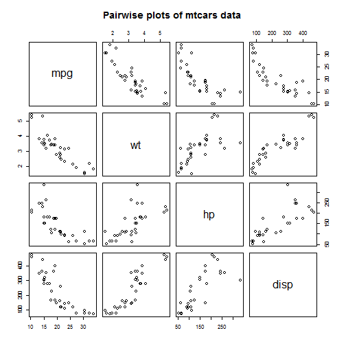

## Overview

- mtcars is an important data set in the Data Science Curriculum
- Used to illustrate a variety of concepts across multiple classes
- It's a good candidate for a starter shiny application
<br><br>
<b>Application:</b> mtcars [Scatterplot Matrix Generator](https://lgreski.shinyapps.io/mtcars_Scatterplot_Matrix_Generator)

--- .class #id

## The Concept


```r
library(datasets)
data(mtcars)
pairs(~ mpg + wt + hp + disp,data=mtcars,
      main="Pairwise plots of mtcars data")
```

 


--- 

## A Simple User Interface


--- 

## Design Considerations

- Handling situation with 0 or 1 checkbox selected
- Parsing the selections and generating a list containing the selected columns
- Converting the selections into the proper format for the `pairs()` function
- Rendering the instructions, and turning them off when two or more variables are selected
- Rendering the scatterplot matrix

--- 

## Additional Features to Be Considered in the Future

1. Starting with a list of data sets rather than a pre-selected one
2. Allowing for a user selected graph type (e.g. group of box plots, etc.)
3. Combining a chart with a statistical analysis (e.g. regression analysis)
4. Allowing the user to print the resulting chart 

## 


